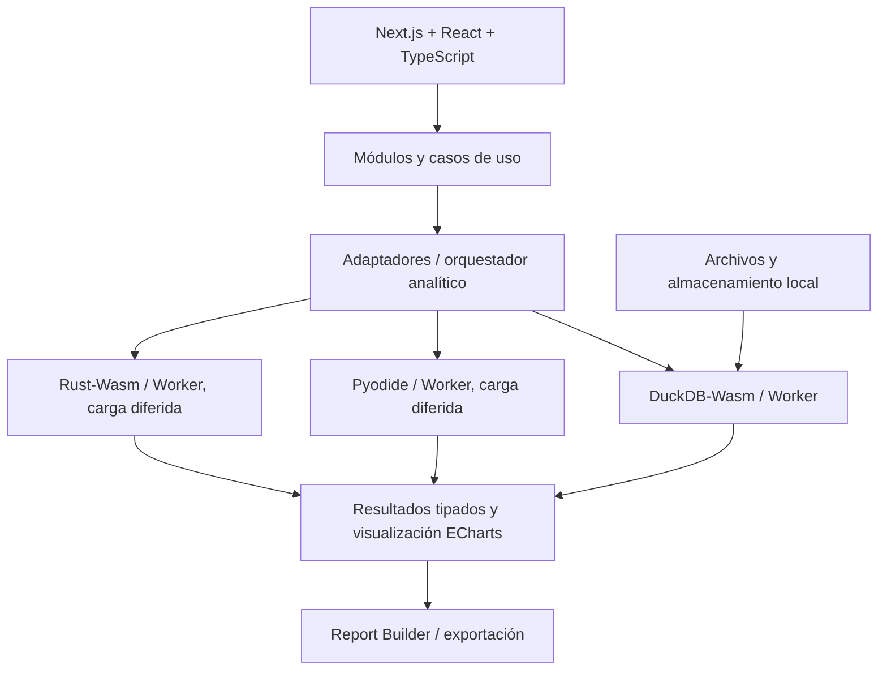

# DataForge

**Plataforma de análisis de datos autoservicio, local-first y ejecutada directamente en el navegador.**

DataForge busca que cualquier persona pueda **importar, explorar, limpiar, combinar, analizar, visualizar y exportar datos** sin configurar un entorno científico ni subir sus archivos a un backend de procesamiento. Un usuario puede analizar una planilla; otro puede construir pipelines reproducibles, trabajar con varios datasets y aplicar análisis estadístico avanzado.

> **Estado: planificación y validación arquitectónica.** Las características que se describen a continuación están **previstas, no implementadas**. El repositorio actualmente contiene documentación; no hay aún aplicación desplegada ni benchmarks que certifiquen el rendimiento.

**Documentación:** [MVP y prioridades](docs/MVP.md) · [Roadmap completo](docs/roadmap.md) · [Roadmap técnico maestro](docs/roadmap-tecnico.md) · [Arquitectura de software](docs/architecture.md) · [Decisiones (ADR)](docs/adr/README.md) · [Reglas para agentes](AGENTS.md)

## ¿Para quién es?

Personas que desean respuestas simples de sus archivos, estudiantes e investigadores, profesionales, analistas de datos y desarrolladores. La complejidad de la interfaz crece según la tarea: análisis rápido para principiantes y workspace avanzado para usuarios técnicos.

**Sin registro obligatorio · En español · Procesamiento local por defecto · Proyecto de portfolio sin infraestructura paga prevista.**

## Funcionalidades planificadas

| Capacidad | ¿Qué permitirá hacer? |
|---|---|
| **Importar y explorar** | CSV, XLSX, JSON tabular, Parquet; vista previa, paginación, schema y calidad |
| **Analizar** | Estadística descriptiva, correlaciones, distribuciones y comparaciones |
| **Visualizar** | Gráficos interactivos y sugerencias basadas en roles semánticos |
| **Preparar** | Limpieza, filtros, deduplicación, tipos, columnas calculadas y pipelines |
| **Combinar** | Múltiples archivos, APPEND/UNION, JOIN validado y comparación |
| **Organizar** | Carpetas, proyectos, datasets versionados y análisis guardados |
| **Informar** | Report Builder, hallazgos explicables, metodología y exportaciones |
| **Investigar** | Estadística Python, forecasting, DTW/Rust y optimización limitada en fases avanzadas |

**Principios:** no modificar fuentes originales; preservar el linaje de datos; mostrar supuestos y limitaciones; no atribuir causalidad a correlaciones; validar resultados contra referencias independientes.

## Plantillas especializadas

Las plantillas **no son aplicaciones independientes**: reutilizan los motores de análisis, el modelo de proyectos, los gráficos y la exportación.

| Plantilla | Capacidades previstas |
|---|---|
| **Análisis libre** | Analizar datasets genéricos desde cero |
| **Finanzas personales** | Registrar movimientos **a mano** o importar archivos, cuentas, ingresos, gastos, presupuestos y reportes |
| **Ventas y negocios** | Facturación, productos, descuentos, devoluciones, evolución y rendimiento |
| **Encuestas e investigación** | Preguntas, frecuencias, escalas Likert, cruces, distribuciones e informes |

### Finanzas personales: registro manual y archivos

El usuario no necesitará crear un CSV para registrar un gasto: contará con formularios de ingresos, egresos, transferencias y movimientos recurrentes. Se contemplarán importaciones bancarias por archivo con mapeo de columnas y detección de posibles duplicados.

Se utilizarán **ARS y USD** inicialmente, con extensibilidad a otras monedas. Las conversiones ARS/USD se plantean con dólar **oficial, MEP, CCL o cotización manual**, incluyendo referencia temporal, fuente y criterio utilizado. No se promediarán cotizaciones de mercados distintos automáticamente.

La contabilidad distinguirá transferencias propias, pagos de tarjeta, reintegros y gastos para evitar dobles conteos. No habrá conexión bancaria automática en el alcance inicial.

Primero llegará **Finanzas Lite** dentro del MVP: registro manual de ingresos y gastos, resumen mensual y gráficos básicos, con ARS y USD por separado y sin conversión. Cuentas, cotizaciones, importación bancaria y ajuste por inflación (IPC) se incorporan después. Ver [MVP](docs/MVP.md).

### Ventas y negocios

La plantilla contemplará análisis de facturación, productos, categorías, volumen, descuentos y devoluciones; se evitará calcular rentabilidad cuando no existan costos confiables o sumar ventas duplicadas por un JOIN incorrecto.

### Encuestas e investigación

Permitirá analizar respuestas de formularios, selección múltiple, escalas y cruces por segmentos, informando número de respuestas válidas, faltantes y limitaciones metodológicas.

## Experiencia de usuario prevista

- **Landing pública** con explicación del producto y acceso sin cuenta.
- **Probar un ejemplo:** datasets de demostración para evaluar la aplicación al instante.
- **Comenzar con mis datos:** carga de archivos o formulario manual en Finanzas.
- **Workspace:** sidebar de navegación, panel central, inspector contextual, gráficos y tablas.
- **Idioma:** español neutro en la interfaz, con configuración regional `es-AR` por defecto para números, fechas y moneda; no es un producto multilingüe.
- **Diseño:** interfaz clara, moderna, accesible, responsive, inicialmente con tema claro.

Los datos locales estarán sujetos a las cuotas y políticas de limpieza del navegador. Habrá opciones para exportar y recuperar proyectos.

## Arquitectura propuesta

**Monolito modular client-side, organizado por funcionalidades (Screaming Architecture / feature-first), con capas y principios hexagonales pragmáticos.**

Los módulos expresarán capacidades del producto —`projects`, `datasets`, `analysis`, `pipelines`, `reports`, `finance`, `sales`, `surveys`—, no solamente frameworks o adaptadores.

Los módulos complejos separarán:
- **Dominio:** entidades, invariantes y reglas de negocio sin dependencias técnicas.
- **Aplicación:** casos de uso, DTO y puertos.
- **Infraestructura:** repositorios y adaptadores concretos.
- **Presentación:** componentes y vistas React.

Los componentes UI sencillos no necesitan una jerarquía hexagonal completa.

### Motores analíticos



- **DuckDB-Wasm:** motor principal de datos tabulares, SQL, agregaciones, importación, profiling, ELT.
- **Pyodide:** Python científico y modelos estadísticos especializados, cargado solo cuando se necesita.
- **Rust/Wasm:** DTW y distancias temporales especializadas, validadas y medidas frente a alternativas.
- **TypeScript + ECharts:** orquestación, UI y gráficos.

La comunicación entre runtimes se realizará mediante formatos de intercambio tipados; **no se asumirá zero-copy** entre memorias WebAssembly independientes. La fase 0 determinará viabilidad y estrategia final.

Más información: [Arquitectura](docs/architecture.md).

## Stack objetivo

| Área | Tecnologías |
|---|---|
| Web | **Next.js** (candidato principal; Vite + React como alternativa evaluada en el [ADR-0001](docs/adr/0001-framework-y-exportacion-estatica.md)), React, TypeScript strict |
| UI | **Tailwind CSS**, **shadcn/ui**, **Lucide React** |
| Tablas | TanStack Table, TanStack Virtual |
| Estado y validación | Zustand cuando haga falta, Zod |
| Gráficos y flujos | Apache ECharts, React Flow cuando se incorpore el editor visual |
| Datos | DuckDB-Wasm |
| Ciencia de datos | Pyodide (Python, NumPy, Pandas, SciPy y paquetes compatibles) |
| Algoritmos | Rust, wasm-bindgen y WebAssembly |
| Persistencia local | IndexedDB + OPFS |
| Pruebas | Vitest, Playwright, tests de Python y Rust |
| Despliegue / CI | Vercel, GitHub Actions |
| Nube futura opcional | Autenticación y Neon PostgreSQL para metadatos |

**No está previsto instalar todas las dependencias desde el comienzo.** Cada incorporación deberá justificarse por una funcionalidad y aprobar las pruebas correspondientes.

## Privacidad y persistencia

**Modo local (primera etapa):**
- Sin cuenta ni backend analítico.
- Archivos procesados en el navegador mediante Web Workers.
- Proyectos y configuraciones guardados localmente con IndexedDB/OPFS, sujetos a compatibilidad y cuotas.
- Copias de seguridad mediante exportación/importación portable.

**Modo conectado (opcional, futuro):**
- Cuentas y carpetas sincronizadas.
- Neon PostgreSQL para metadatos, nunca como depósito principal de archivos grandes.
- Subida explícita y voluntaria a almacenamiento privado si se desarrolla sincronización completa.
- Datos y ejecución locales por defecto, también para personas registradas.

El candidato principal es **Next.js con exportación estática** para landing y aplicación; la decisión se confirma en la fase 0A ([ADR-0001](docs/adr/0001-framework-y-exportacion-estatica.md)). Una futura autenticación dinámica obligará a revisar el modo de despliegue; no forma parte del MVP.

## Objetivos de capacidad (no garantías)

| Escenario | Objetivo provisional |
|---|---|
| Dataset moderado | ~100.000 filas, según ancho, tipos y navegador |
| CSV / Parquet | Límite inicial orientativo de 20 MB por archivo |
| Excel XLSX | Límite inicial orientativo de 10 MB por archivo |
| Estrés posterior | Hasta 500.000 filas / 100 MB en escenarios adecuados |
| Rendimiento | Workers, lazy loading, paginación, virtualización y agregación |

Estos números son hipótesis que requieren benchmarks; el protocolo de medición y los umbrales provisionales están en el [ADR-0002](docs/adr/0002-motores-analiticos-y-criterios-de-corte.md). **Paginación de tabla no equivale a ingesta por lotes.** Excel comprimido puede expandirse mucho más en memoria.

## Roadmap resumido

| Fase | Alcance |
|---|---|
| **0A** | Fundamento tabular: Next.js (o Vite), DuckDB-Wasm, CSV/XLSX y despliegue estático |
| **0B – 0C** | Spikes acotados de Pyodide y de Rust/Wasm |
| **1** | Landing, UI y gestión de proyectos locales |
| **2** | Importación multiformato, Data Explorer y profiling |
| **3** | Estadística descriptiva, gráficos e insights básicos |
| **3B** | **Finanzas Lite**: registro manual ARS/USD y resumen mensual |
| **4** | Pipelines, limpieza y múltiples datasets |
| **5** | Report Builder y exportación de proyectos |
| **6** | Finanzas completas: cuentas, transferencias e importación |
| **7** | Finanzas avanzadas, cotizaciones ARS/USD |
| **7B** | Plantillas Ventas y Encuestas |
| **8** | Python científico y forecasting |
| **9** | Rust/Wasm y DTW |
| **10** | Optimización matemática y modelado (opcional) |
| **11** | Hardening, E2E, benchmarks y publicación |
| **Cloud C1–C2** | Cuentas y sincronización opcionales, sin bloquear las fases anteriores |

El **MVP (R1)** abarca las fases 0A a 3B: ver [MVP.md](docs/MVP.md). [Consultar roadmap completo y criterios de aceptación](docs/roadmap.md).

## Estructura prevista

```text
DataForge/
├── src/
│   ├── app/                   # Landing y rutas de Next.js
│   ├── modules/               # Dominio por funcionalidades
│   │   ├── projects/
│   │   ├── datasets/
│   │   ├── analysis/
│   │   ├── pipelines/
│   │   ├── reports/
│   │   ├── finance/
│   │   ├── sales/
│   │   ├── surveys/
│   │   ├── forecasting/
│   │   └── time-series/
│   ├── platform/              # Workers, motores, persistencia
│   └── shared/                # UI y utilidades realmente compartidas
├── python/
├── rust/
├── tests/
├── e2e/
├── benchmarks/
├── AGENTS.md
├── docs/
│   ├── MVP.md
│   ├── roadmap.md
│   ├── architecture.md
│   ├── adr/
│   └── design/
└── .github/workflows/
```

**Es una estructura objetivo, no carpetas ya existentes.** Se creará gradualmente al implementar cada fase.

## Calidad

Las reglas de trabajo con agentes de IA están en [AGENTS.md](AGENTS.md).

- Dominio desacoplado de React, Next.js, IndexedDB, DuckDB, Pyodide y Rust.
- Pruebas unitarias de negocio, pruebas de contrato para adaptadores y E2E de recorridos reales.
- Validar cálculos estadísticos, financieros y DTW con implementaciones independientes.
- Proteger frente a archivos malformados, inyección SQL, exportaciones peligrosas y errores de memoria.
- Mostrar límites y metodología; no prometer rendimiento o funciones no verificadas.
- Documentar decisiones arquitectónicas (ADR) y actualizar el roadmap conforme se avance.
- Priorizar releases útiles y mantener una separación honesta entre planificado e implementado.

## Próximos pasos

- [x] Crear repositorio.
- [x] Consolidar roadmap y arquitectura de planificación.
- [x] Acotar el MVP, redactar ADR-0001 y ADR-0002 (estado «Propuesto») y separar las reglas de agentes en AGENTS.md.
- [ ] Fase 0A: esqueleto (Next.js o Vite según ADR-0001), DuckDB-Wasm en un Worker, importar CSV/XLSX y mostrar vista previa.
- [ ] Fase 0A: mediciones y despliegue estático en Vercel.
- [ ] Fases 0B y 0C: spikes de Pyodide bajo demanda y de Rust/Wasm.
- [ ] Cerrar ADR-0001 y ADR-0002 con resultados medidos.
- [ ] Publicar la primera demo funcional (R1).

## Documentación y referencias

- [MVP y prioridades](docs/MVP.md)
- [Roadmap detallado](docs/roadmap.md)
- [Arquitectura de software](docs/architecture.md)
- [Decisiones de arquitectura (ADR)](docs/adr/README.md)
- [Next.js](https://nextjs.org/docs)
- [DuckDB-Wasm](https://duckdb.org/docs/stable/clients/wasm/overview)
- [Pyodide](https://pyodide.org/)
- [wasm-bindgen](https://rustwasm.github.io/docs/wasm-bindgen/)
- [Apache ECharts](https://echarts.apache.org/)
- [shadcn/ui](https://ui.shadcn.com/)

---

**Proyecto educativo, open-source y de portfolio.** Licencia y URL de demo por definir. Objetivo: crear análisis útiles, explicables y reproducibles sin infraestructura paga de procesamiento.

## Asistente de IA e integraciones (extensiones opcionales)

> **Visión futura, fuera del MVP.**

**DataForge AI** permitirá explicar estadísticas calculadas, redactar informes y conversar sobre resultados mediante un chatbot contextual. El motor analítico seguirá siendo determinista y las respuestas deberán referenciar métricas verificables. Se contemplan tres alternativas:

- **IA local:** evaluar Chrome Built-in AI en equipos/navegadores compatibles; ninguna migración automática a servicios remotos.
- **Vercel AI Gateway:** informes asistidos y chat con streaming, bajo límites de cuota y consentimiento para enviar contexto seleccionado.
- **BYOK:** clave propia del usuario. Su almacenamiento persistente en el servidor (cifrado AES-256-GCM) se difiere hasta que existan cuentas; la clave nunca se registra en logs ni se devuelve al frontend.

Las consultas asistidas (text-to-SQL) serían de solo lectura y con aprobación previa del usuario; tampoco pertenecen al MVP.

**DataForge Connect** contemplará importar desde APIs REST y, en una etapa conectada, recibir eventos/datasets de otras aplicaciones con claves limitadas por proyecto, ingestas idempotentes y almacenamiento temporal. Los motores de análisis permanecerán en el navegador.

**Autenticación futura opcional:** registro con email/contraseña, verificación y recuperación mediante proveedor gestionado; evaluación de Neon Auth/Better Auth y correo transaccional. El uso local y anónimo continuará funcionando sin registro. Se propone registro para mayores de 18 años, sujeto a revisión jurídica.

**Documentación:** [IA y chatbot](docs/ai-assistant.md) · [Integraciones](docs/integrations.md) · [Autenticación](docs/authentication.md).

## Referencias de interfaz y políticas


> **Referencia visual**, no captura de una aplicación ya implementada. [Guía de UI y mockups](docs/design/README.md). Los [tres PNG originales](docs/design/mockups/README.md) ya están incorporados y documentados en el repositorio como referencias visuales, no capturas de la aplicación.

Se elaboraron **borradores no publicables**, sujetos a completar identidad/contacto y revisión jurídica antes del lanzamiento con cuentas o procesamiento remoto:

- [Términos de uso](docs/legal/terms-of-use.md)
- [Política de privacidad](docs/legal/privacy-policy.md)
- [Avisos sobre IA y finanzas](docs/legal/ai-financial-disclaimer.md)

Estos textos no constituyen una garantía de inmunidad legal. La seguridad, el consentimiento y el tratamiento real de datos deberán validarse técnicamente y documentarse antes de ofrecer servicios conectados.
