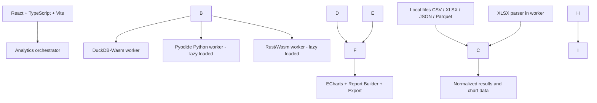

# DataForge

**Browser-native self-service data analytics workspace** — explore, clean, combine, analyze, visualize and export your own datasets without uploading them to an application backend.

> \*\*Status: planning / architecture validation.\*\* This repository documents a proposed product. Features below are \*\*planned\*\*, not yet implemented. No performance claims have been validated.

## Product vision

DataForge is designed for anyone who needs useful answers from CSV, Excel, JSON or Parquet files without installing a data-science stack or sending private datasets to a processing server. A casual user can upload a spreadsheet and receive a transparent data-quality report and suggested visualizations. An analyst can build reproducible transformations, join datasets, inspect statistics and export reports. Advanced modules will support Python-based statistics and time-series algorithms implemented in Rust.

**Principles**

* **Local-first:** computation and data analysis occur in the user's browser; static assets may be hosted on Vercel. No application processing backend is required for the planned core features.
* **Progressive complexity:** useful releases from early phases, with optional engines loaded only when needed.
* **One engine per job:** DuckDB-Wasm for tabular SQL/ELT; Pyodide for Python scientific workflows; Rust/Wasm for specialized intensive algorithms; TypeScript for UI, orchestration, and interactive charts.
* **Trustworthy results:** report lineage, assumptions, formulas, data coverage and limitations; never infer causation from correlation.
* **Reproducibility:** configurations, pipeline steps, analysis parameters and exports are versionable.

## Core workflows (planned)

1. **Import:** CSV, XLSX, JSON and Parquet. Inspect sheets, headers, delimiter/encoding, inferred types, and a bounded preview.
2. **Profile:** row/column counts, missingness, duplicate candidates, unique values, ranges, and quality warnings.
3. **Analyze:** descriptive statistics, category frequencies, distributions, group comparisons, correlations and suitable visualizations.
4. **Prepare:** non-destructive filters, type conversions, null handling, deduplication, calculated columns and reusable SQL-backed transformation pipelines.
5. **Combine:** append compatible files, join related tables using confirmed keys, compare datasets, and retain analysis snapshots and lineage.
6. **Report:** explanatory findings with traceable evidence, chosen charts, methodology and limitations; export HTML and processed CSV/Parquet.
7. **Advanced analytics (later):** statistical inference, forecasting/backtesting, time-series similarity (DTW), and constrained optimization scenarios.

## Target architecture (subject to Phase 0 validation)



**DuckDB-Wasm:** primary tabular engine, ingestion, SQL, descriptive statistics, aggregation, ELT, multi-file workspace. **TypeScript:** feature orchestration, worker lifecycle, file controls, visualization. **Pyodide:** Pandas/NumPy/SciPy/statsmodels for specialized analysis and forecasting. **Rust/Wasm (wasm-bindgen):** exact/constraint-window Dynamic Time Warping and pairwise distances, preceded by correctness checks and benchmarks against baselines.

Exchange metadata as JSON, tables via an explicitly specified transfer format such as Arrow IPC, and time-series vectors as typed arrays. **Do not assume zero-copy** between independent WASM runtimes. Avoid copying entire datasets into every engine; select required columns and subsets first. The team will evaluate a Pyodide-hosted DuckDB option if dual SQL/Python runtime overhead is too high.

## Initial capability targets — not guarantees

|Item|Planning target|Validation needed|
|-|-|-|
|Core input formats|CSV, XLSX, JSON, Parquet|Complex/nested documents handled explicitly|
|Typical dataset|Up to \~100,000 rows|Vary width, cardinality and cell length|
|Initial CSV / Parquet upload cap|20 MB|Benchmark across desktop/mobile|
|Initial XLSX upload cap|10 MB|Compressed-size and decompressed-memory checks|
|Later stress target|500,000 rows / 100 MB (select formats)|No promise of universal support|
|Processing|Worker-based, bounded and cancelable when possible|Heap use, latency, browser stability|
|Deployment|Static Vercel hosting|Build and asset-size checks|

**Pagination is not streaming ingestion.** Virtualized tables should avoid rendering every row; ingestion should use DuckDB's native capabilities where suitable. For Excel, loading ranges from ZIP-contained XML requires special handling and memory limits. A file's row count alone is insufficient to predict memory use.

## Analysis catalog (planned)

|Module|Example outputs|Primary engine|
|-|-|-|
|Data profiling|inferred types, null counts, duplicate checks, completeness|DuckDB-Wasm|
|Descriptive statistics|mean, median, mode, quantiles, variance, standard deviation, IQR, skewness|DuckDB-Wasm|
|Visual analytics|bar, line, histogram, box plot, scatter, heatmap, pie for few categories|DuckDB + ECharts|
|Relationships|pivot/crosstab, Pearson correlation, grouped distributions|DuckDB-Wasm|
|Statistical analysis|confidence intervals, Spearman, hypothesis tests, diagnostics|Pyodide + SciPy|
|Forecasting|naive/seasonal baselines, time-series backtesting, error measures, optional models|Pyodide|
|Time-series similarity|Euclidean distance, DTW, restricted DTW, alignment and pairwise matrices|Rust/Wasm|
|Optimization|small linear or mixed-integer resource allocation models|Pyodide + SciPy|
|Report building|HTML report, provenance, evidence, limitations, export|TypeScript + chart snapshots|

**Automatic recommendations must be rule-based and explainable.** A numeric identifier must not be treated automatically as a meaningful metric. Statistical tests and forecasts require user confirmation, adequate data and clear assumptions. Optimization needs an objective, decision variables, and constraints; it cannot be inferred from an arbitrary dataset.

## Multi-dataset workspace

A workspace contains immutable **source datasets**, versioned **derived datasets**, saved **pipelines**, and **analysis snapshots** recording source versions, transformations, filters, metrics, and chart settings.

* **Append / union:** compatible schemas or confirmed mappings; missing columns handled explicitly.
* **Join:** the user chooses keys, join type and expected cardinality; guard against multiplicative joins.
* **Compare:** analyze two periods or datasets using matching definitions.
* **Incremental updates:** recompute where necessary; means/medians/statistics are not generally combined by averaging earlier summaries.
* **Persistence (later):** OPFS subject to browser support and quotas; workspace export/import is the portable fallback.

## Delivery roadmap

Every phase ends with documented acceptance criteria, tests, a working build and a demo where applicable.

|Phase|Focus|Definition of done (high level)|
|-|-|-|
|**0**|Architecture spike|Static Vercel proof-of-concept: XLSX → DuckDB; optional Pyodide and Rust module can execute; measure transfer overhead and memory|
|**1**|Data Explorer|Import CSV/XLSX/JSON/Parquet; bounded previews; schema inspection; data profiling; safe error handling|
|**2**|Visual Analytics|Chart recommendations, configurable aggregations and graphs, basic correlations and cross-tabs|
|**3**|Cleaning \& Pipelines|Non-destructive transformations; ordered steps; previews; export and replayable definitions|
|**4**|Multi-Dataset Workspace|Multiple inputs, append/join/compare, versioned derived datasets and lineage|
|**5**|Insights \& Reports|Explainable findings, HTML reports, selected visuals and data exports|
|**6**|Python Statistics|Lazy Pyodide, reproducible statistical analyses, verified results and worker cancellation/limits|
|**7**|Forecasting \& Time Series|Baseline forecasts + backtests; DTW Rust/Wasm; alignment visualization; performance guardrails|
|**8**|Optimization \& Modeling|Limited resource-allocation templates and regression diagnostics, only if valuable after user testing|
|**9**|Hardening \& Release|Accessibility, E2E, dataset safety, benchmark reports, optional local persistence, portfolio polish|

**Priority order:** robust ingestion → useful profiling → reproducible transformations → multi-dataset analysis → informative reports → specialized analytics. Future functionality requires an explicit product/technical rationale, not technology accumulation.

## Security, privacy and reliability requirements

* No processing uploads to a remote backend in the planned core product. Clearly disclose third-party assets/telemetry and disable unnecessary analytics.
* Bound memory, time, compressed input expansion, table widths, chart point counts and the number of simultaneous jobs.
* Run heavy operations in workers, provide progress or honest indeterminate states and cancellation where supported.
* Treat all uploaded files as untrusted; protect against malformed XLSX/ZIP/XML, formulas on spreadsheet export, hostile text in HTML reports, and SQL injection via dynamically generated identifiers/expressions.
* Prefer prepared queries and validated/escaped identifiers; never directly execute untrusted AI-generated SQL or Python.
* Perform numerical correctness tests against independent reference implementations and well-understood fixture datasets.
* Make statistical method, missing-data treatment, sample sizes and assumptions visible in reports.
* Mobile capability may be constrained; explain limits instead of silently crashing.

## Engineering and quality gates

* TypeScript strict mode; modular feature/engine contracts; separate workers from UI.
* Tests: parser/validation fixtures, profiling, transformation idempotence where appropriate, join cardinality, statistics and Rust DTW edge cases; Playwright E2E with small representative files.
* CI: lint, typecheck, frontend tests, Python tests (when present), `cargo test` and WASM build (when present), production build and smoke tests.
* Benchmarks: report hardware, browser/version, file format, rows, columns, peak memory, import time, profiling time, query latency, worker/bootstrap times and chart rendering.
* Benchmark matrices: 1,000×10; 10,000×20; 100,000×30; 100,000×100; optional 500,000×30. Vary numeric/text/date distributions and XLSX/CSV/Parquet representations.
* No invented speedup goals; report positive and negative outcomes.

## Proposed repository layout

```text
dataforge/
  src/
    app/
    features/{importer,explorer,profiling,visualizations,pipelines,workspace,reports,statistics,time-series,optimization}/
    engines/{duckdb,python,rust,orchestrator}/
    workers/
    shared/
  python/{statistics,forecasting,modeling}/
  rust/src/{lib.rs,dtw.rs,distances.rs}
  tests/
  e2e/
  benchmarks/
  docs/{prd,architecture,adr,roadmap,qa,agent-handoff}/
  .github/workflows/
```

The folders represent a **proposed layout**, not currently existing implementation.

## Working with AI coding agents

For an incoming agent or LLM:

1. Read this README, inspect the actual repository, and explicitly distinguish implemented functionality from planned scope.
2. Start with Phase 0. Do not bootstrap all engines, packages, databases or cloud services at once.
3. Propose a bounded change with observable acceptance criteria, files affected, data/compute risks and tests.
4. Ask for evidence before adding libraries or infrastructure. Keep processing in-browser unless the project's owner changes that constraint.
5. Never claim a capability, performance figure, deployment or test run unless verified.
6. Run available tests, document failures and tradeoffs, update changelog/ADR as decisions change.
7. Keep the user in charge of domain decisions and statistical interpretation. AI-generated code must be reviewable and reproducible.

## Immediate next actions

* \[ ] Create the repository and protect the main branch as appropriate.
* \[ ] Set up a Vite/React/TypeScript skeleton and a static deployment.
* \[ ] Phase 0: XLSX import to DuckDB-Wasm with a safe row preview.
* \[ ] Phase 0: load a small Pyodide function only on demand; measure its startup overhead.
* \[ ] Phase 0: compile a minimal Rust/Wasm function and call it from a worker.
* \[ ] Measure cross-engine data transfer, memory use and browser support.
* \[ ] Decide whether to retain separate DuckDB-Wasm and Pyodide runtimes before expanding scope.
* \[ ] Write ADR-0001 documenting measured architectural choice.

## Reference documentation

* [DuckDB-Wasm](https://duckdb.org/docs/stable/clients/wasm/overview)
* [DuckDB-Wasm file ingestion](https://duckdb.org/docs/stable/clients/wasm/data_ingestion)
* [Pyodide](https://pyodide.org/en/stable/)
* [wasm-bindgen](https://rustwasm.github.io/docs/wasm-bindgen/)
* [Vite static deployment](https://vite.dev/guide/static-deploy)
* [Apache ECharts](https://echarts.apache.org/)

\---

**Project type:** portfolio + educational open-source product. **License, final branding, dependency versions, and deployment URL:** to be determined.

