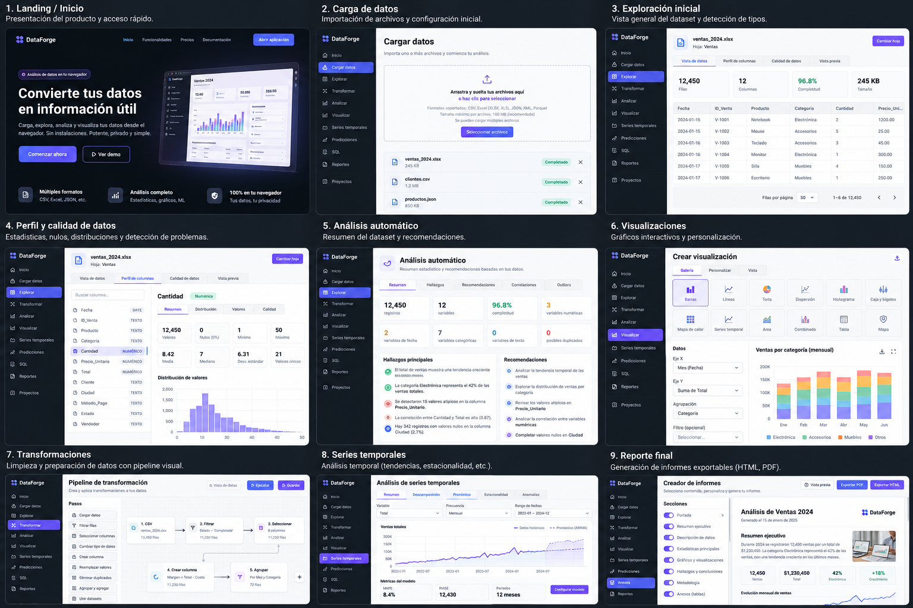
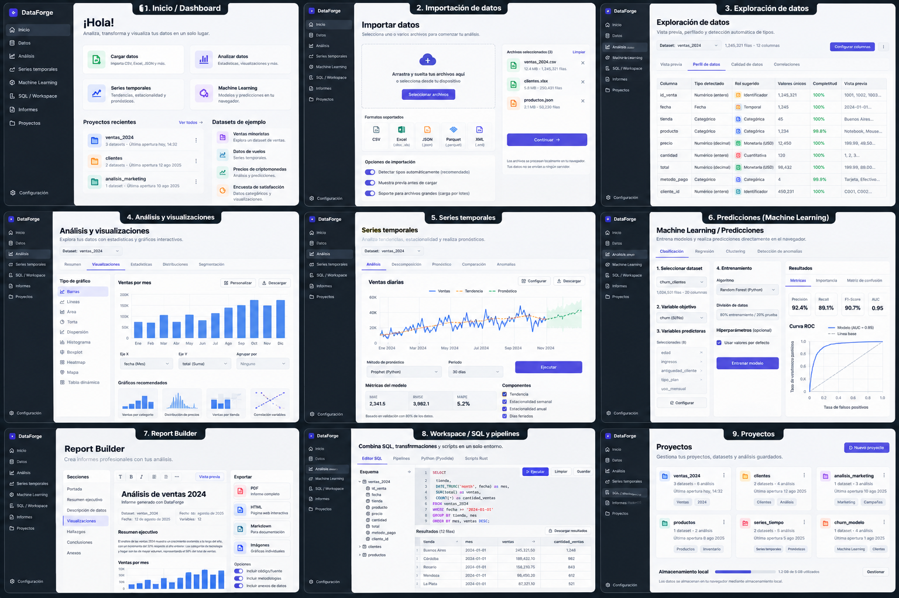
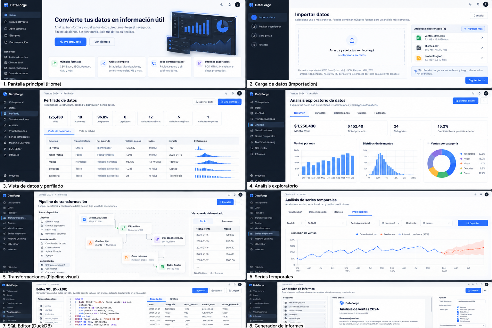
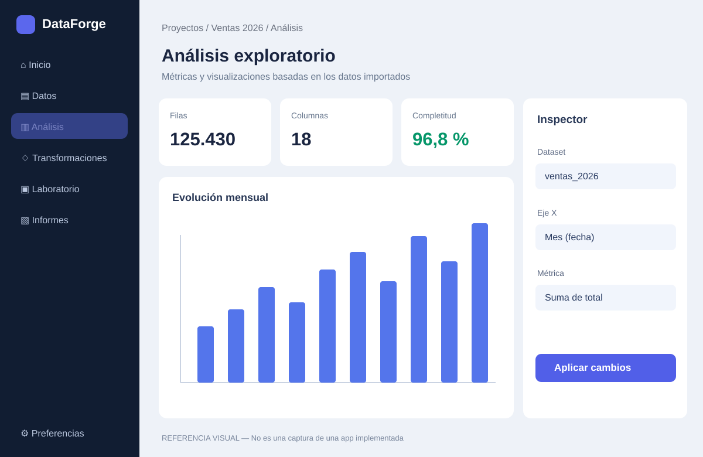

# DataForge — Diseño de interfaz y experiencia de usuario

> **Estado:** dirección visual aprobada para planificación. Los PNG siguientes son **mockups conceptuales generados**, no capturas de pantallas implementadas ni especificaciones pixel-perfect. El estado funcional real está documentado en el [README principal](../../README.md) y el [roadmap](../roadmap.md).

## 1. Galería de mockups originales

Los **tres PNG originales están versionados en GitHub** y constituyen la referencia estética primaria para desarrollar DataForge. Se conservan sus nombres originales para no duplicar archivos ni romper enlaces.

### Concepto 1 — Recorrido completo del producto

[Ver imagen completa](./mockups/a_wide_clean_dark_light_modern_ui_mockup_collage.png)

**Referencia:** presentación del producto y secuencia de trabajo, desde cargar un archivo hasta obtener un informe. Útil para diseñar landing, onboarding, importación y pasos del flujo analítico.

### Concepto 2 — Módulos y navegación del workspace

[Ver imagen completa](./mockups/a_wide_clean_modern_ui_ux_mockup_collage_of_a_da.png)

**Referencia:** coherencia entre pantallas, sidebar, gestión de proyectos, laboratorio SQL, informes y herramientas avanzadas. Útil para definir layouts, navegación, menús y componentes reutilizables.

### Concepto 3 — Dashboard analítico y composición visual

[Ver imagen completa](./mockups/a_wide_clean_ui_ux_mockup_collage_on_a_dark_to_li.png)

**Referencia:** jerarquía visual de métricas, tarjetas, tablas, gráficos, formularios de configuración y pipelines. Útil para implementar el área de análisis.

**Galería detallada, nombres originales y pautas para agentes:** [`mockups/README.md`](./mockups/README.md).

### Referencia vectorial secundaria

El [SVG del workspace](./workspace-reference.svg) es una guía complementaria creada para documentar la composición general. **En caso de diferencias estéticas, priorizar los tres PNG originales y las decisiones explícitas de este documento.**

---

## 2. Objetivo UX

DataForge debe resultar accesible tanto para alguien que quiere analizar un Excel por primera vez como para una persona que trabaja con SQL, pipelines y modelos estadísticos.

**Una sola aplicación, con complejidad progresiva:**

- **Análisis rápido:** importar archivo, revisar calidad, visualizar métricas, obtener informe.
- **Espacio de trabajo avanzado:** gestionar proyectos, múltiples datasets, transformaciones, consultas, experimentos y análisis reproducibles.
- **Plantillas especializadas:** Finanzas Personales, Ventas y Negocios, Encuestas e Investigación, junto a Análisis Libre.
- **Demostraciones:** datasets ficticios o públicos para probar la aplicación sin cuenta ni archivo propio.

La aplicación debe funcionar **sin registro**. Las cuentas, la sincronización y la IA remota son opciones futuras; no deben bloquear los flujos locales.

## 3. Estructura de navegación

Mantener una barra lateral **breve y consistente**:

| Sección | Contenido |
|---|---|
| **Inicio** | Proyectos/carpetas, archivos recientes, plantillas y ejemplos |
| **Datos** | Importación, explorador tabular, perfilado y esquema |
| **Análisis** | Estadísticas, visualizaciones, correlaciones y hallazgos |
| **Transformaciones** | Limpieza, pasos de pipelines, joins y composición |
| **Laboratorio** | SQL, Python, series temporales, forecasting, Rust y optimización, según fase |
| **Informes** | Report Builder, vista previa, metodología y exportación |

Las herramientas y algoritmos individuales se organizan mediante **pestañas o controles contextuales**; no deben saturar la navegación global.

### Layout del workspace

1. **Sidebar izquierda:** identidad DataForge, módulos, navegación y estado del proyecto.
2. **Barra superior:** proyecto/dataset activo, breadcrumb, acciones y estado de guardado.
3. **Panel central:** tablas, dashboard, canvas de pipeline o editor/informe.
4. **Inspector contextual derecho:** variables, métricas, filtros y opciones del elemento seleccionado.
5. **Feedback de procesos:** indicadores de actividad, progreso, cancelación cuando corresponda y recuperación de errores.

El contexto del proyecto debe conservarse al cambiar de módulo. No obligar a reimportar o reconfigurar variables para crear informes.

## 4. Sistema visual

| Elemento | Dirección |
|---|---|
| **Tema inicial** | Claro, con sidebar oscura |
| **Colores** | Neutros para estructura; azul/violeta como acento; colores semánticos accesibles |
| **Tipografía** | Legibilidad y jerarquía clara en tablas, métricas, formularios y textos |
| **Componentes** | Superficies discretas, tarjetas, tabs, selects, paneles y estados vacíos |
| **Tablas** | Alta densidad controlada, números alineados, filas virtualizadas/paginadas |
| **Gráficos** | Ejes y unidades legibles, leyendas consistentes y tooltip claro |
| **Iconos** | Lucide React, coherentes en tamaño y significado |
| **Tema oscuro** | Previsto como extensión mediante tokens; no rehacer cada pantalla |

### Herramientas previstas

- **Tailwind CSS + shadcn/ui:** componentes UI y sistema de diseño con tokens.
- **Lucide React:** iconografía.
- **TanStack Table + TanStack Virtual:** exploración de tablas.
- **Apache ECharts:** visualizaciones analíticas.
- **React Flow:** canvas de pipelines cuando se implemente esa fase.
- **Next.js + React + TypeScript:** shell, rutas, interfaz y coordinación.

No instalar dependencias adelantadas solo porque aparezcan representadas en los mockups.

## 5. Pantallas objetivo

| Pantalla | Acciones prioritarias |
|---|---|
| **Landing pública** | Entender producto, entrar sin cuenta, probar demo |
| **Inicio / Proyectos** | Crear/abrir proyecto, organizar carpetas, elegir plantilla |
| **Importar** | Arrastrar o elegir CSV/XLSX/JSON/Parquet, validar y mapear |
| **Data Explorer** | Vista previa, tipos/roles semánticos, nulos, duplicados |
| **Análisis** | Seleccionar métricas, aplicar filtros, consultar gráficos |
| **Pipelines** | Transformar sin alterar fuentes, revisar pasos y ejecución |
| **Laboratorio** | SQL, análisis científico y series temporales según implementación |
| **Informes** | Seleccionar gráficos, redactar conclusiones, exportar |
| **Finanzas Personales** | Registrar movimientos manuales, revisar presupuestos e indicadores |
| **Asistente IA** | Explicar métricas e informes con consentimiento, cuando esté disponible |

El módulo financiero, las plantillas nuevas y el chatbot pueden necesitar vistas adicionales que **no figuran en los PNG**. Deben seguir la misma identidad visual.

## 6. Responsive, accesibilidad y contenido

- **Desktop-first, no desktop-only:** usar el espacio disponible en pantallas grandes sin romper tablets o móviles.
- La sidebar podrá compactarse y el inspector pasar a **drawer** en pantallas angostas.
- Las tablas extensas necesitan scroll apropiado; no truncar números o nombres sin alternativa.
- Navegación con teclado, foco visible, etiquetas accesibles, contraste y feedback para procesos largos.
- No usar exclusivamente el color para representar un estado.
- Ofrecer tabla de valores o resumen accesible cuando un gráfico comunique información esencial.
- Todo en **español**; usar formatos numéricos y fechas claros y configurar moneda **ARS/USD** según contexto, sin conversiones implícitas.
- Los datos de ejemplo deben etiquetarse como **ficticios**; los valores, texto y gráficos presentes en los mockups no constituyen datasets reales ni cálculos verificados.

## 7. Reglas para agentes de implementación

1. **Mirar los tres PNG originales** antes de proponer una nueva pantalla.
2. Consultar el [roadmap](../roadmap.md) y desarrollar solo la fase actual.
3. Mantener navegación, tokens visuales, spacing, estados y nomenclatura consistentes.
4. Extraer componentes reutilizables cuando haya reutilización real; evitar un archivo global monolítico de estilos.
5. No copiar literalmente textos defectuosos o cifras inventadas de las imágenes generadas.
6. No inferir funcionalidades implementadas por su aparición en un mockup.
7. No hacer llamadas a IA, servicios externos ni inicializar motores pesados solo para renderizar una pantalla.
8. Validar resultados en navegador con capturas reales, pruebas responsive y revisión de accesibilidad.
9. Documentar las desviaciones relevantes del concepto y justificarlas por UX, rendimiento o accesibilidad.

## 8. Criterios de aceptación visual

- Sidebar, layout principal e inspector alineados con las referencias.
- Navegación y proyecto activo consistentes entre pantallas.
- Estilos de botones, tarjetas, métricas, tablas y formularios reutilizables.
- Loading, vacío, error y éxito con estados definidos.
- Funcionalidad básica sin cuenta, sin IA y sin Pyodide/Rust durante el arranque.
- Gráficos con fuentes y unidades claras; no valores ficticios presentados como reales.
- La UI mantiene coherencia tanto en flujo simple como en workspace avanzado.

---

**Documentos relacionados:** [Galería de PNG originales](./mockups/README.md) · [Roadmap](../roadmap.md) · [Arquitectura](../architecture.md) · [README principal](../../README.md).
